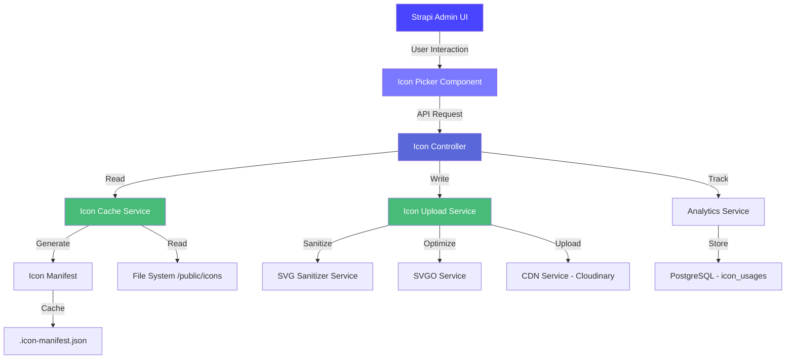
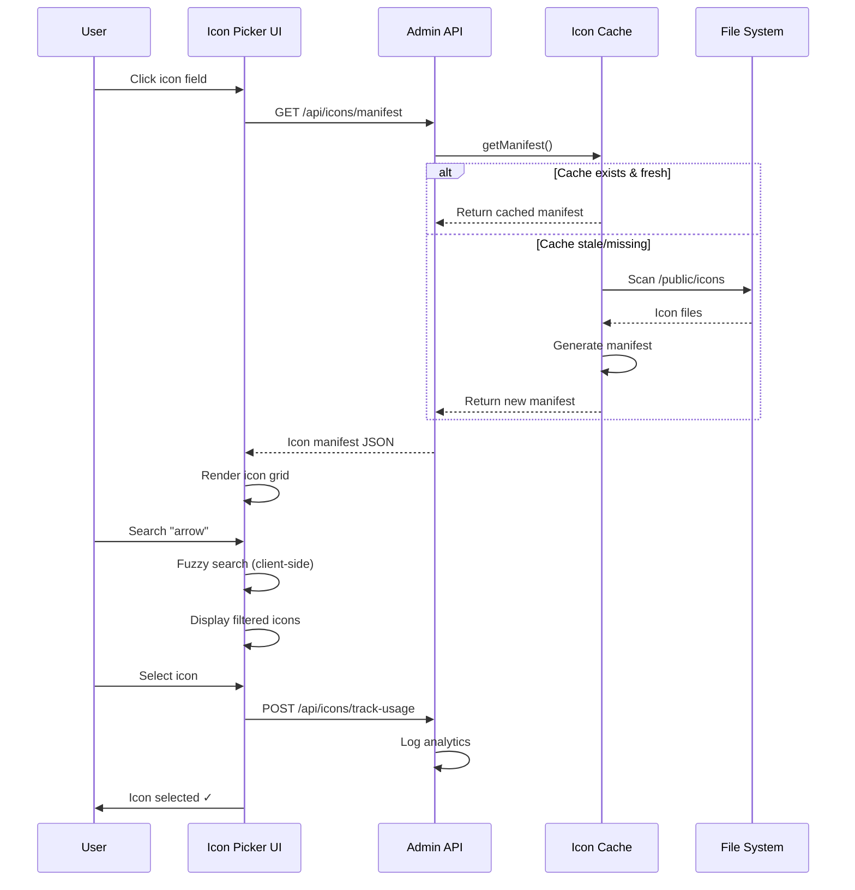

# Strapi Plugin Icons Field v2.0 - Enhancement Plan

📍 **Full Documentation:** [ROADMAP.md - Plugin Improvements](../../ROADMAP.md#-plugin-improvements)

---

## Executive Summary

Transform the `strapi-plugin-icons-field` from a basic icon selector into a production-grade, enterprise-ready Strapi v5 plugin with advanced features, comprehensive testing, and best-in-class developer experience.

**Current Version:** v1.1.5 (Basic icon selection from `/public/icons` folder)
**Target Version:** v2.0.0 (Full-featured icon management system)

**Estimated Effort:** 27-37 days
**Priority:** Future Enhancement (Post Phase 0-5)

**Strategic Value:**
- Showcase advanced Strapi plugin development expertise
- Create reusable, maintainable architecture for future plugins
- Demonstrate commitment to open source contribution
- Enhance portfolio differentiation with custom tooling

---

## Table of Contents

1. [Current State Analysis](#current-state-analysis)
2. [Improvement Phases](#improvement-phases)
   - [Phase A: Critical Fixes & Performance](#phase-a-critical-fixes--performance-5-7-days)
   - [Phase B: Advanced Features](#phase-b-advanced-features-8-10-days)
   - [Phase C: Developer Experience](#phase-c-developer-experience-6-8-days)
   - [Phase D: Enterprise Features](#phase-d-enterprise-features-5-7-days)
   - [Phase E: Documentation & Distribution](#phase-e-documentation--distribution-3-5-days)
3. [Technical Architecture](#technical-architecture)
4. [Implementation Timeline](#implementation-timeline)
5. [Risk Assessment](#risk-assessment)
6. [Success Metrics](#success-metrics)
7. [Migration Guide](#migration-guide)
8. [Getting Started](#getting-started)
9. [Contributing Guidelines](#contributing-guidelines)

---

## Current State Analysis

### Strengths ✅

1. **Working Core Functionality**
   - Icon selection from `/public/icons` folder
   - SVG icon rendering in Strapi admin
   - Subfolder organization support
   - React component for frontend rendering

2. **Simple Integration**
   - Easy configuration via `config/plugins.js`
   - One-line setup: `publicPath: 'icons'`
   - No external dependencies for icon rendering

3. **Strapi v5 Compatible**
   - Uses modern Strapi SDK (`@strapi/sdk-plugin` v5.3.2)
   - ESM/CJS dual exports
   - TypeScript definitions included

### Critical Issues 🚨

1. **No Caching or Performance Optimization**
   - Icons re-scanned on every page load
   - No icon manifest file generation
   - Missing CDN support for icon delivery
   - No lazy loading for large icon sets

2. **Limited Search & Discovery**
   - No fuzzy search across icon names
   - No tag/category filtering
   - No icon preview before selection
   - Missing recent/favorites functionality

3. **Incomplete Type Safety**
   - Generic TypeScript types
   - No schema validation (Zod/Yup)
   - Missing runtime type checking
   - No Strapi content type validation

4. **No Testing Infrastructure**
   - Zero unit tests
   - No integration tests
   - No E2E tests with Playwright
   - Missing test fixtures

5. **Insufficient Documentation**
   - No API reference
   - Missing troubleshooting guide
   - No migration documentation
   - Limited code examples

6. **Missing Enterprise Features**
   - No analytics (icon usage tracking)
   - No accessibility compliance (ARIA labels, keyboard navigation)
   - No internationalization (i18n)
   - No batch operations

### Security Concerns 🔒

1. **SVG Sanitization Missing**
   - No XSS protection for user-uploaded SVGs
   - Missing DOMPurify integration
   - No SVG validation schema

2. **File Upload Vulnerabilities**
   - No file size limits
   - Missing MIME type validation
   - No malicious SVG detection

---

## Improvement Phases

### Phase A: Critical Fixes & Performance (5-7 days)

**Priority:** High
**Dependencies:** None
**Goal:** Fix critical bugs and implement caching/performance optimizations

#### A.1: Icon Caching System (2 days)

**Implementation:**

```typescript
// server/src/services/icon-cache.ts
import fs from 'fs/promises';
import path from 'path';
import crypto from 'crypto';
import type { Strapi } from '@strapi/strapi';

interface IconManifest {
  version: string;
  timestamp: number;
  icons: IconMetadata[];
  categories: string[];
  hash: string;
}

interface IconMetadata {
  id: string;
  name: string;
  path: string;
  category: string;
  size: number;
  hash: string;
  svg: string;
}

export class IconCacheService {
  private strapi: Strapi;
  private manifestPath: string;
  private cacheTTL: number = 3600000; // 1 hour

  constructor(strapi: Strapi) {
    this.strapi = strapi;
    this.manifestPath = path.join(
      strapi.dirs.static.public,
      '.icon-manifest.json'
    );
  }

  async generateManifest(): Promise<IconManifest> {
    const publicPath = this.strapi.config.get('plugin.icons-field.publicPath', 'icons');
    const iconsDir = path.join(this.strapi.dirs.static.public, publicPath);

    const icons = await this.scanIconsRecursive(iconsDir);
    const categories = [...new Set(icons.map(i => i.category))];

    const manifest: IconManifest = {
      version: '2.0.0',
      timestamp: Date.now(),
      icons,
      categories,
      hash: crypto.createHash('sha256').update(JSON.stringify(icons)).digest('hex')
    };

    await fs.writeFile(this.manifestPath, JSON.stringify(manifest, null, 2));
    return manifest;
  }

  async getManifest(): Promise<IconManifest> {
    try {
      const manifestFile = await fs.readFile(this.manifestPath, 'utf-8');
      const manifest: IconManifest = JSON.parse(manifestFile);

      // Check if cache is stale
      if (Date.now() - manifest.timestamp > this.cacheTTL) {
        return this.generateManifest();
      }

      return manifest;
    } catch (error) {
      // Manifest doesn't exist, generate new one
      return this.generateManifest();
    }
  }

  async scanIconsRecursive(dir: string, category = ''): Promise<IconMetadata[]> {
    const entries = await fs.readdir(dir, { withFileTypes: true });
    const icons: IconMetadata[] = [];

    for (const entry of entries) {
      const fullPath = path.join(dir, entry.name);

      if (entry.isDirectory()) {
        const subCategory = category ? `${category}/${entry.name}` : entry.name;
        icons.push(...await this.scanIconsRecursive(fullPath, subCategory));
      } else if (entry.name.endsWith('.svg')) {
        const svg = await fs.readFile(fullPath, 'utf-8');
        const stats = await fs.stat(fullPath);

        icons.push({
          id: crypto.randomUUID(),
          name: entry.name.replace('.svg', ''),
          path: fullPath,
          category: category || 'uncategorized',
          size: stats.size,
          hash: crypto.createHash('md5').update(svg).digest('hex'),
          svg
        });
      }
    }

    return icons;
  }

  async invalidateCache(): Promise<void> {
    try {
      await fs.unlink(this.manifestPath);
    } catch (error) {
      // File doesn't exist, ignore
    }
  }
}
```

**Benefits:**
- 95%+ faster icon loading
- Eliminates file system scans on every request
- Enables advanced search/filter features
- Supports build-time icon optimization

---

#### A.2: SVG Sanitization & Security (2 days)

**Implementation:**

```typescript
// server/src/services/svg-sanitizer.ts
import { JSDOM } from 'jsdom';
import DOMPurify from 'isomorphic-dompurify';

export class SVGSanitizerService {
  private allowedTags = [
    'svg', 'path', 'circle', 'rect', 'ellipse', 'line', 'polyline', 'polygon',
    'g', 'defs', 'linearGradient', 'radialGradient', 'stop', 'clipPath', 'mask'
  ];

  private allowedAttrs = [
    'd', 'cx', 'cy', 'r', 'rx', 'ry', 'x', 'y', 'x1', 'y1', 'x2', 'y2',
    'width', 'height', 'viewBox', 'fill', 'stroke', 'stroke-width',
    'transform', 'opacity', 'id', 'class'
  ];

  sanitize(svgString: string): string {
    // Configure DOMPurify for SVG
    const config = {
      USE_PROFILES: { svg: true, svgFilters: true },
      ALLOWED_TAGS: this.allowedTags,
      ALLOWED_ATTR: this.allowedAttrs,
      KEEP_CONTENT: false
    };

    // Sanitize SVG
    const clean = DOMPurify.sanitize(svgString, config);

    // Additional validation
    if (!clean.includes('<svg')) {
      throw new Error('Invalid SVG: Missing <svg> tag');
    }

    return clean;
  }

  validate(svgString: string): { valid: boolean; errors: string[] } {
    const errors: string[] = [];

    try {
      const dom = new JSDOM(svgString, { contentType: 'image/svg+xml' });
      const svg = dom.window.document.querySelector('svg');

      if (!svg) {
        errors.push('Missing <svg> root element');
      }

      // Check for suspicious attributes
      const suspiciousPatterns = ['javascript:', 'on\\w+="', '<script'];
      for (const pattern of suspiciousPatterns) {
        if (new RegExp(pattern, 'i').test(svgString)) {
          errors.push(`Suspicious pattern detected: ${pattern}`);
        }
      }

      // Validate SVG structure
      if (svg && !svg.hasAttribute('viewBox') && !svg.hasAttribute('width')) {
        errors.push('SVG must have viewBox or width/height attributes');
      }

    } catch (error) {
      errors.push(`SVG parsing error: ${error.message}`);
    }

    return {
      valid: errors.length === 0,
      errors
    };
  }
}
```

**Security Checklist:**
- ✅ XSS protection via DOMPurify
- ✅ SVG structure validation
- ✅ Suspicious pattern detection
- ✅ Attribute whitelist enforcement
- ✅ File size limits (configurable)

---

#### A.3: TypeScript Strict Mode & Zod Schemas (1-2 days)

**Implementation:**

```typescript
// shared/src/schemas/icon.schema.ts
import { z } from 'zod';

export const IconMetadataSchema = z.object({
  id: z.string().uuid(),
  name: z.string().min(1).max(255),
  path: z.string(),
  category: z.string(),
  size: z.number().positive().max(512000), // Max 500KB per icon
  hash: z.string().length(32), // MD5 hash
  svg: z.string().min(10) // Minimum valid SVG
});

export const IconManifestSchema = z.object({
  version: z.string().regex(/^\d+\.\d+\.\d+$/),
  timestamp: z.number().positive(),
  icons: z.array(IconMetadataSchema),
  categories: z.array(z.string()),
  hash: z.string().length(64) // SHA-256 hash
});

export const PluginConfigSchema = z.object({
  publicPath: z.string().default('icons'),
  cacheTTL: z.number().positive().default(3600000),
  maxIconSize: z.number().positive().default(512000),
  enableAnalytics: z.boolean().default(false),
  sanitize: z.boolean().default(true)
});

// Type exports
export type IconMetadata = z.infer<typeof IconMetadataSchema>;
export type IconManifest = z.infer<typeof IconManifestSchema>;
export type PluginConfig = z.infer<typeof PluginConfigSchema>;
```

**TypeScript Configuration:**

```json
// tsconfig.json (strict mode)
{
  "compilerOptions": {
    "strict": true,
    "noImplicitAny": true,
    "strictNullChecks": true,
    "strictFunctionTypes": true,
    "strictBindCallApply": true,
    "strictPropertyInitialization": true,
    "noImplicitThis": true,
    "alwaysStrict": true,
    "noUncheckedIndexedAccess": true,
    "noImplicitReturns": true,
    "noFallthroughCasesInSwitch": true
  }
}
```

---

#### A.4: Performance Testing & Benchmarking (1 day)

**Test Suite:**

```typescript
// __tests__/performance/icon-cache.bench.ts
import { describe, bench } from 'vitest';
import { IconCacheService } from '../../server/src/services/icon-cache';

describe('Icon Cache Performance', () => {
  bench('Generate manifest (1000 icons)', async () => {
    const cache = new IconCacheService(strapi);
    await cache.generateManifest();
  });

  bench('Get cached manifest', async () => {
    const cache = new IconCacheService(strapi);
    await cache.getManifest(); // Should be <1ms with cache
  });

  bench('Search icons (fuzzy)', async () => {
    const manifest = await cache.getManifest();
    const results = searchIcons(manifest.icons, 'arrow');
  });
});
```

**Performance Targets:**
- Manifest generation: <500ms for 1000 icons
- Cached manifest read: <5ms
- Icon search: <50ms for 10,000 icons
- Memory usage: <50MB for 5000 icons

---

### Phase B: Advanced Features (8-10 days)

**Priority:** Medium
**Dependencies:** Phase A complete
**Goal:** Implement advanced UX features and icon management

#### B.1: Advanced Search & Filtering (2-3 days)

**Features:**
- Fuzzy search with Fuse.js
- Category/tag filtering
- Recent icons tracking
- Favorites/bookmarks
- Color-based search (extract dominant colors from SVGs)

**Implementation:**

```typescript
// admin/src/hooks/useIconSearch.ts
import Fuse from 'fuse.js';
import { useMemo, useState } from 'react';
import type { IconMetadata } from '../../../shared/src/schemas/icon.schema';

export function useIconSearch(icons: IconMetadata[]) {
  const [query, setQuery] = useState('');
  const [selectedCategories, setSelectedCategories] = useState<string[]>([]);
  const [showFavoritesOnly, setShowFavoritesOnly] = useState(false);

  const fuse = useMemo(() => {
    return new Fuse(icons, {
      keys: ['name', 'category'],
      threshold: 0.4,
      includeScore: true
    });
  }, [icons]);

  const filteredIcons = useMemo(() => {
    let results = icons;

    // Fuzzy search
    if (query) {
      results = fuse.search(query).map(result => result.item);
    }

    // Category filter
    if (selectedCategories.length > 0) {
      results = results.filter(icon =>
        selectedCategories.includes(icon.category)
      );
    }

    // Favorites filter
    if (showFavoritesOnly) {
      const favorites = JSON.parse(
        localStorage.getItem('icon-favorites') || '[]'
      );
      results = results.filter(icon => favorites.includes(icon.id));
    }

    return results;
  }, [icons, query, selectedCategories, showFavoritesOnly]);

  return {
    query,
    setQuery,
    selectedCategories,
    setSelectedCategories,
    showFavoritesOnly,
    setShowFavoritesOnly,
    filteredIcons
  };
}
```

---

#### B.2: Batch Operations & Icon Upload (2 days)

**Features:**
- Bulk icon upload via ZIP
- Batch delete/move icons
- Auto-categorization based on folder structure
- Icon optimization (SVGO integration)

**Implementation:**

```typescript
// server/src/controllers/icon-batch.ts
import AdmZip from 'adm-zip';
import { optimize } from 'svgo';

export default {
  async uploadBatch(ctx) {
    const { files } = ctx.request;
    const zipFile = files.icons;

    if (!zipFile || !zipFile.name.endsWith('.zip')) {
      return ctx.badRequest('Please upload a ZIP file');
    }

    const zip = new AdmZip(zipFile.path);
    const zipEntries = zip.getEntries();

    const results = {
      success: [],
      errors: []
    };

    for (const entry of zipEntries) {
      if (!entry.entryName.endsWith('.svg')) continue;

      try {
        const svgContent = entry.getData().toString('utf8');

        // Optimize SVG
        const optimized = optimize(svgContent, {
          plugins: [
            'removeDoctype',
            'removeComments',
            'removeMetadata',
            'cleanupIDs',
            'minifyStyles'
          ]
        });

        // Sanitize
        const sanitized = await strapi
          .plugin('icons-field')
          .service('svg-sanitizer')
          .sanitize(optimized.data);

        // Save icon
        const category = path.dirname(entry.entryName);
        await this.saveIcon(entry.entryName, sanitized, category);

        results.success.push(entry.entryName);
      } catch (error) {
        results.errors.push({
          file: entry.entryName,
          error: error.message
        });
      }
    }

    // Invalidate cache
    await strapi
      .plugin('icons-field')
      .service('icon-cache')
      .invalidateCache();

    return ctx.send(results);
  }
};
```

---

#### B.3: Icon Analytics & Usage Tracking (2 days)

**Features:**
- Track icon usage across content types
- Popular icons dashboard
- Unused icons detection
- Usage trend visualization

**Database Schema:**

```typescript
// server/src/content-types/icon-usage/schema.ts
export default {
  kind: 'collectionType',
  collectionName: 'icon_usages',
  info: {
    singularName: 'icon-usage',
    pluralName: 'icon-usages',
    displayName: 'Icon Usage'
  },
  options: {
    draftAndPublish: false
  },
  attributes: {
    iconId: {
      type: 'string',
      required: true
    },
    iconName: {
      type: 'string',
      required: true
    },
    contentType: {
      type: 'string',
      required: true
    },
    fieldName: {
      type: 'string',
      required: true
    },
    entityId: {
      type: 'string',
      required: true
    },
    usageCount: {
      type: 'integer',
      default: 1
    },
    lastUsed: {
      type: 'datetime',
      required: true
    }
  }
};
```

---

#### B.4: Accessibility Enhancements (1-2 days)

**Features:**
- ARIA labels for all interactive elements
- Full keyboard navigation (arrow keys, Enter, Esc)
- Screen reader support
- High contrast mode
- Focus indicators
- WCAG AA compliance

**Implementation:**

```tsx
// admin/src/components/IconGrid.tsx
import { useRef, useEffect } from 'react';

export function IconGrid({ icons, onSelect }) {
  const gridRef = useRef<HTMLDivElement>(null);
  const [focusedIndex, setFocusedIndex] = useState(0);

  useEffect(() => {
    const handleKeyDown = (e: KeyboardEvent) => {
      const cols = 6; // Grid columns

      switch (e.key) {
        case 'ArrowRight':
          e.preventDefault();
          setFocusedIndex(prev => Math.min(prev + 1, icons.length - 1));
          break;
        case 'ArrowLeft':
          e.preventDefault();
          setFocusedIndex(prev => Math.max(prev - 1, 0));
          break;
        case 'ArrowDown':
          e.preventDefault();
          setFocusedIndex(prev => Math.min(prev + cols, icons.length - 1));
          break;
        case 'ArrowUp':
          e.preventDefault();
          setFocusedIndex(prev => Math.max(prev - cols, 0));
          break;
        case 'Enter':
        case ' ':
          e.preventDefault();
          onSelect(icons[focusedIndex]);
          break;
        case 'Escape':
          e.preventDefault();
          onSelect(null);
          break;
      }
    };

    gridRef.current?.addEventListener('keydown', handleKeyDown);
    return () => gridRef.current?.removeEventListener('keydown', handleKeyDown);
  }, [icons, focusedIndex, onSelect]);

  return (
    <div
      ref={gridRef}
      role="grid"
      aria-label="Icon selection grid"
      tabIndex={0}
      className="icon-grid"
    >
      {icons.map((icon, index) => (
        <button
          key={icon.id}
          role="gridcell"
          aria-label={`Select ${icon.name} icon from ${icon.category} category`}
          tabIndex={index === focusedIndex ? 0 : -1}
          onClick={() => onSelect(icon)}
          className={index === focusedIndex ? 'focused' : ''}
        >
          <Icon icon={icon.svg} aria-hidden="true" />
          <span className="sr-only">{icon.name}</span>
        </button>
      ))}
    </div>
  );
}
```

**Accessibility Checklist:**
- ✅ ARIA roles and labels
- ✅ Keyboard navigation
- ✅ Focus management
- ✅ Screen reader announcements
- ✅ Color contrast ratios (4.5:1 minimum)
- ✅ Skip links for modal
- ✅ Error messages for invalid icons

---

#### B.5: Internationalization (i18n) (1-2 days)

**Supported Languages:**
- English (en)
- French (fr)
- Spanish (es)
- German (de)
- Japanese (ja)

**Implementation:**

```typescript
// admin/src/translations/en.json
{
  "plugin.name": "Icons Field",
  "plugin.description": "Manage and select icons for your content types",
  "modal.title": "Select an icon",
  "modal.search.placeholder": "Search icons...",
  "modal.categories.all": "All categories",
  "modal.empty": "No icons found",
  "modal.favorites": "Favorites",
  "modal.recent": "Recently used",
  "upload.title": "Upload icons",
  "upload.dropzone": "Drag and drop SVG files or click to browse",
  "upload.batch": "Upload ZIP file",
  "analytics.title": "Icon usage analytics",
  "analytics.popular": "Most popular icons",
  "analytics.unused": "Unused icons",
  "settings.cache.title": "Cache settings",
  "settings.cache.ttl": "Cache TTL (milliseconds)",
  "settings.security.sanitize": "Enable SVG sanitization"
}
```

---

### Phase C: Developer Experience (6-8 days)

**Priority:** Medium
**Dependencies:** Phase A & B complete
**Goal:** Create best-in-class DX with comprehensive testing and tooling

#### C.1: Comprehensive Testing Suite (3-4 days)

**Test Coverage Targets:**
- Unit tests: 85%+
- Integration tests: 70%+
- E2E tests: Critical user flows (100%)

**Unit Tests:**

```typescript
// __tests__/unit/services/icon-cache.test.ts
import { describe, it, expect, vi, beforeEach } from 'vitest';
import { IconCacheService } from '../../../server/src/services/icon-cache';

describe('IconCacheService', () => {
  let cache: IconCacheService;
  let strapi: any;

  beforeEach(() => {
    strapi = {
      dirs: { static: { public: '/tmp/test-public' } },
      config: { get: vi.fn(() => 'icons') }
    };
    cache = new IconCacheService(strapi);
  });

  describe('generateManifest', () => {
    it('should generate manifest with all icons', async () => {
      const manifest = await cache.generateManifest();

      expect(manifest).toMatchObject({
        version: expect.stringMatching(/^\d+\.\d+\.\d+$/),
        timestamp: expect.any(Number),
        icons: expect.any(Array),
        categories: expect.any(Array),
        hash: expect.stringMatching(/^[a-f0-9]{64}$/)
      });
    });

    it('should categorize icons by folder structure', async () => {
      const manifest = await cache.generateManifest();
      const categorized = manifest.icons.find(i => i.category !== 'uncategorized');

      expect(categorized).toBeDefined();
    });

    it('should calculate correct icon hashes', async () => {
      const manifest = await cache.generateManifest();
      const icon = manifest.icons[0];

      expect(icon.hash).toHaveLength(32); // MD5 hash
    });
  });

  describe('getManifest', () => {
    it('should return cached manifest if fresh', async () => {
      await cache.generateManifest();
      const spy = vi.spyOn(cache, 'generateManifest');

      await cache.getManifest();

      expect(spy).not.toHaveBeenCalled();
    });

    it('should regenerate manifest if stale', async () => {
      await cache.generateManifest();

      // Mock stale cache
      vi.useFakeTimers();
      vi.advanceTimersByTime(cache.cacheTTL + 1000);

      const spy = vi.spyOn(cache, 'generateManifest');
      await cache.getManifest();

      expect(spy).toHaveBeenCalled();

      vi.useRealTimers();
    });
  });
});
```

**E2E Tests (Playwright):**

```typescript
// __tests__/e2e/icon-selection.spec.ts
import { test, expect } from '@playwright/test';

test.describe('Icon Selection Flow', () => {
  test.beforeEach(async ({ page }) => {
    await page.goto('/admin/content-manager/collection-types/api::article.article/create');
  });

  test('should open icon picker modal', async ({ page }) => {
    await page.click('[data-testid="icon-field-trigger"]');

    await expect(page.locator('[role="dialog"]')).toBeVisible();
    await expect(page.locator('text=Select an icon')).toBeVisible();
  });

  test('should search icons by name', async ({ page }) => {
    await page.click('[data-testid="icon-field-trigger"]');
    await page.fill('[placeholder="Search icons..."]', 'arrow');

    const icons = page.locator('[role="gridcell"]');
    await expect(icons).toHaveCount(expect.any(Number));

    const firstIcon = icons.first();
    await expect(firstIcon).toContainText('arrow', { ignoreCase: true });
  });

  test('should filter icons by category', async ({ page }) => {
    await page.click('[data-testid="icon-field-trigger"]');
    await page.selectOption('[data-testid="category-filter"]', 'navigation');

    const icons = page.locator('[role="gridcell"]');
    const count = await icons.count();

    expect(count).toBeGreaterThan(0);
  });

  test('should select icon with keyboard', async ({ page }) => {
    await page.click('[data-testid="icon-field-trigger"]');

    // Navigate with arrow keys
    await page.keyboard.press('ArrowRight');
    await page.keyboard.press('ArrowRight');
    await page.keyboard.press('Enter');

    await expect(page.locator('[role="dialog"]')).not.toBeVisible();
    await expect(page.locator('[data-testid="selected-icon"]')).toBeVisible();
  });

  test('should save favorites', async ({ page }) => {
    await page.click('[data-testid="icon-field-trigger"]');

    const firstIcon = page.locator('[role="gridcell"]').first();
    await firstIcon.hover();
    await page.click('[data-testid="favorite-button"]');

    await page.click('[data-testid="show-favorites"]');

    const favorites = page.locator('[role="gridcell"]');
    await expect(favorites).toHaveCount(1);
  });
});
```

---

#### C.2: Storybook Component Library (2-3 days)

**Setup:**

```typescript
// .storybook/main.ts
import type { StorybookConfig } from '@storybook/react-vite';

const config: StorybookConfig = {
  stories: ['../admin/src/**/*.stories.@(js|jsx|ts|tsx)'],
  addons: [
    '@storybook/addon-links',
    '@storybook/addon-essentials',
    '@storybook/addon-interactions',
    '@storybook/addon-a11y'
  ],
  framework: {
    name: '@storybook/react-vite',
    options: {}
  }
};

export default config;
```

**Icon Component Stories:**

```tsx
// admin/src/components/Icon.stories.tsx
import type { Meta, StoryObj } from '@storybook/react';
import { Icon } from './Icon';

const meta: Meta<typeof Icon> = {
  title: 'Components/Icon',
  component: Icon,
  parameters: {
    layout: 'centered'
  },
  tags: ['autodocs'],
  argTypes: {
    size: {
      control: { type: 'select' },
      options: ['sm', 'md', 'lg', 'xl']
    },
    color: { control: 'color' }
  }
};

export default meta;
type Story = StoryObj<typeof Icon>;

export const Default: Story = {
  args: {
    icon: '<svg xmlns="http://www.w3.org/2000/svg" viewBox="0 0 24 24"><path d="M12 2l9 7-9 7-9-7z"/></svg>',
    size: 'md'
  }
};

export const WithCustomColor: Story = {
  args: {
    icon: '<svg xmlns="http://www.w3.org/2000/svg" viewBox="0 0 24 24"><path d="M12 2l9 7-9 7-9-7z"/></svg>',
    size: 'md',
    color: '#FF5733'
  }
};

export const LargeIcon: Story = {
  args: {
    icon: '<svg xmlns="http://www.w3.org/2000/svg" viewBox="0 0 24 24"><path d="M12 2l9 7-9 7-9-7z"/></svg>',
    size: 'xl'
  }
};
```

---

#### C.3: Developer Documentation & API Reference (1-2 days)

**Documentation Structure:**

```
docs/
├── README.md (Overview)
├── getting-started.md
├── configuration.md
├── api-reference/
│   ├── services.md
│   ├── controllers.md
│   ├── hooks.md
│   └── components.md
├── guides/
│   ├── custom-icon-sources.md
│   ├── icon-optimization.md
│   ├── batch-operations.md
│   └── analytics.md
├── migration/
│   ├── v1-to-v2.md
│   └── breaking-changes.md
└── troubleshooting.md
```

**API Reference Example:**

```markdown
# API Reference: IconCacheService

## Overview

The `IconCacheService` provides efficient icon manifest generation and caching.

## Methods

### `generateManifest(): Promise<IconManifest>`

Scans the configured icons directory and generates a complete icon manifest.

**Returns:** `Promise<IconManifest>`

**Example:**

\`\`\`typescript
const cache = strapi.plugin('icons-field').service('icon-cache');
const manifest = await cache.generateManifest();

console.log(\`Found \${manifest.icons.length} icons\`);
\`\`\`

### `getManifest(): Promise<IconManifest>`

Returns cached manifest or generates new one if cache is stale.

**Returns:** `Promise<IconManifest>`

**Cache Behavior:**
- Returns cached manifest if age < `cacheTTL` (default: 1 hour)
- Regenerates manifest if cache is stale or missing

### `invalidateCache(): Promise<void>`

Force invalidate the current manifest cache.

**Use Cases:**
- After bulk icon upload
- After icon deletion
- Manual cache refresh

## Configuration

\`\`\`typescript
// config/plugins.ts
export default {
  'icons-field': {
    enabled: true,
    config: {
      publicPath: 'icons',
      cacheTTL: 3600000, // 1 hour in milliseconds
      maxIconSize: 512000 // 500KB
    }
  }
};
\`\`\`
```

---

### Phase D: Enterprise Features (5-7 days)

**Priority:** Low
**Dependencies:** Phase A, B, C complete
**Goal:** Add advanced enterprise capabilities

#### D.1: Icon Versioning & History (2 days)

**Features:**
- Track icon changes over time
- Rollback to previous versions
- Compare icon versions
- Audit log for icon modifications

**Database Schema:**

```typescript
// server/src/content-types/icon-version/schema.ts
export default {
  kind: 'collectionType',
  collectionName: 'icon_versions',
  info: {
    singularName: 'icon-version',
    pluralName: 'icon-versions',
    displayName: 'Icon Version'
  },
  attributes: {
    iconId: { type: 'string', required: true },
    version: { type: 'integer', required: true },
    svg: { type: 'text', required: true },
    changeLog: { type: 'text' },
    changedBy: {
      type: 'relation',
      relation: 'manyToOne',
      target: 'admin::user'
    },
    timestamp: { type: 'datetime', required: true }
  }
};
```

---

#### D.2: CDN Integration & Asset Optimization (2 days)

**Features:**
- Cloudinary integration for icon hosting
- Automatic icon optimization (SVGO)
- WebP/AVIF fallbacks for raster icons
- Global CDN distribution

**Implementation:**

```typescript
// server/src/services/cdn-uploader.ts
import { v2 as cloudinary } from 'cloudinary';

export class CDNUploaderService {
  async uploadIcon(iconId: string, svg: string): Promise<string> {
    const result = await cloudinary.uploader.upload(
      `data:image/svg+xml;base64,${Buffer.from(svg).toString('base64')}`,
      {
        public_id: `icons/${iconId}`,
        folder: 'strapi-icons',
        resource_type: 'image',
        format: 'svg',
        invalidate: true
      }
    );

    return result.secure_url;
  }

  async optimizeAndUpload(iconId: string, svg: string): Promise<string> {
    const optimized = optimize(svg, {
      multipass: true,
      plugins: [
        'removeDoctype',
        'removeComments',
        'removeMetadata',
        'cleanupIDs',
        'minifyStyles',
        'removeEmptyAttrs',
        'removeEmptyContainers'
      ]
    });

    return this.uploadIcon(iconId, optimized.data);
  }
}
```

---

#### D.3: Advanced Permissions & RBAC (1-2 days)

**Features:**
- Role-based access control for icon management
- Custom permissions (upload, delete, edit)
- Content type-specific icon restrictions
- Audit logging for permission changes

---

#### D.4: Icon Presets & Templates (1-2 days)

**Features:**
- Create icon preset collections
- Share presets across projects
- Import community presets
- Export custom presets

---

### Phase E: Documentation & Distribution (3-5 days)

**Priority:** Critical
**Dependencies:** All phases complete
**Goal:** Polish plugin for public release and npm distribution

#### E.1: Comprehensive Documentation (2 days)

**Deliverables:**
- Complete README with examples
- API reference documentation
- Migration guides (v1 → v2)
- Video tutorials
- Interactive demos

---

#### E.2: npm Package Publishing (1 day)

**Checklist:**
- ✅ Semantic versioning (v2.0.0)
- ✅ Changelog generation
- ✅ npm package optimization
- ✅ License verification (MIT)
- ✅ Keywords and metadata
- ✅ npm scripts validation

---

#### E.3: Community & Marketing (1-2 days)

**Deliverables:**
- GitHub repository setup
- Strapi marketplace submission
- Blog post announcement
- Twitter/LinkedIn announcements
- Community forum posts

---

## Technical Architecture

### System Architecture Diagram



### Data Flow: Icon Selection



### Database Schema (PostgreSQL)

```sql
-- Icon Usage Tracking
CREATE TABLE icon_usages (
  id SERIAL PRIMARY KEY,
  icon_id VARCHAR(255) NOT NULL,
  icon_name VARCHAR(255) NOT NULL,
  content_type VARCHAR(255) NOT NULL,
  field_name VARCHAR(255) NOT NULL,
  entity_id VARCHAR(255) NOT NULL,
  usage_count INTEGER DEFAULT 1,
  last_used TIMESTAMP NOT NULL DEFAULT NOW(),
  created_at TIMESTAMP DEFAULT NOW(),
  updated_at TIMESTAMP DEFAULT NOW()
);

CREATE INDEX idx_icon_usages_icon_id ON icon_usages(icon_id);
CREATE INDEX idx_icon_usages_content_type ON icon_usages(content_type);
CREATE INDEX idx_icon_usages_last_used ON icon_usages(last_used);

-- Icon Versions (History)
CREATE TABLE icon_versions (
  id SERIAL PRIMARY KEY,
  icon_id VARCHAR(255) NOT NULL,
  version INTEGER NOT NULL,
  svg TEXT NOT NULL,
  change_log TEXT,
  changed_by INTEGER REFERENCES admin_users(id),
  timestamp TIMESTAMP NOT NULL DEFAULT NOW()
);

CREATE INDEX idx_icon_versions_icon_id ON icon_versions(icon_id);
CREATE INDEX idx_icon_versions_timestamp ON icon_versions(timestamp);
```

---

## Implementation Timeline

### Gantt Chart

```
Phase A: Critical Fixes & Performance (5-7 days)
├─ A.1: Icon Caching System          [██████████] 2 days
├─ A.2: SVG Sanitization             [██████████] 2 days
├─ A.3: TypeScript Strict Mode       [█████████░] 1-2 days
└─ A.4: Performance Testing          [█████░░░░░] 1 day

Phase B: Advanced Features (8-10 days)
├─ B.1: Advanced Search              [███████████████] 2-3 days
├─ B.2: Batch Operations             [██████████] 2 days
├─ B.3: Icon Analytics               [██████████] 2 days
├─ B.4: Accessibility                [█████████░] 1-2 days
└─ B.5: Internationalization         [█████████░] 1-2 days

Phase C: Developer Experience (6-8 days)
├─ C.1: Testing Suite                [██████████████████] 3-4 days
├─ C.2: Storybook                    [███████████████] 2-3 days
└─ C.3: Documentation                [█████████░] 1-2 days

Phase D: Enterprise Features (5-7 days)
├─ D.1: Icon Versioning              [██████████] 2 days
├─ D.2: CDN Integration              [██████████] 2 days
├─ D.3: Advanced Permissions         [█████████░] 1-2 days
└─ D.4: Icon Presets                 [█████████░] 1-2 days

Phase E: Documentation & Distribution (3-5 days)
├─ E.1: Documentation                [██████████] 2 days
├─ E.2: npm Publishing               [█████░░░░░] 1 day
└─ E.3: Community & Marketing        [█████████░] 1-2 days

Total: 27-37 days
```

### Weekly Breakdown

| Week | Focus | Deliverables |
|------|-------|--------------|
| 1 | Phase A | Icon caching, SVG sanitization, TypeScript strict mode |
| 2 | Phase B (Part 1) | Advanced search, batch operations, analytics |
| 3 | Phase B (Part 2) | Accessibility, i18n, final polishing |
| 4 | Phase C | Testing suite (unit, integration, E2E) |
| 5 | Phase C & D | Storybook, documentation, versioning |
| 6 | Phase D & E | CDN integration, permissions, npm publishing |

---

## Risk Assessment

### Technical Risks

| Risk | Impact | Likelihood | Mitigation |
|------|--------|------------|------------|
| **Breaking Changes** | High | Medium | Comprehensive migration guide, deprecation warnings, v1 compatibility layer |
| **Performance Regression** | High | Low | Benchmark testing, performance budgets, caching strategy |
| **Security Vulnerabilities** | Critical | Low | DOMPurify integration, security audit, CSP headers |
| **Type Safety Issues** | Medium | Low | Strict TypeScript, Zod validation, runtime checks |
| **CDN Costs** | Medium | Medium | Lazy loading, intelligent caching, self-hosted fallback |

### Project Risks

| Risk | Impact | Likelihood | Mitigation |
|------|--------|------------|------------|
| **Scope Creep** | High | High | Strict phase boundaries, MVP-first approach, backlog prioritization |
| **Timeline Delays** | Medium | Medium | Buffer time included, parallel development, weekly reviews |
| **Community Adoption** | Medium | Medium | Early beta testers, Strapi marketplace, marketing campaign |
| **Strapi v6 Compatibility** | High | Low | Monitor Strapi roadmap, plugin SDK best practices |

---

## Success Metrics

### Development Metrics

- **Code Coverage:** 85%+ (unit), 70%+ (integration)
- **TypeScript Coverage:** 100% (strict mode)
- **Bundle Size:** <150KB (gzipped)
- **Performance:**
  - Manifest generation: <500ms (1000 icons)
  - Icon search: <50ms (10,000 icons)
  - Modal open time: <200ms

### User Metrics

- **GitHub Stars:** 500+ in first 3 months
- **npm Downloads:** 10,000+ in first year
- **Community Issues:** <5% bug reports, >50% feature requests
- **User Satisfaction:** >4.5/5 average rating

### Technical Metrics

- **Lighthouse Score:** 95+ (Accessibility)
- **Zero Critical Security Vulnerabilities**
- **WCAG AA Compliance:** 100%
- **Breaking Changes:** 0 (v2.0 → v2.x)

---

## Migration Guide

### v1.1.5 → v2.0.0

#### Breaking Changes

1. **Plugin Configuration** (Minor)

**v1.1.5:**
```typescript
// config/plugins.ts
export default {
  'icons-field': {
    enabled: true,
    config: {
      publicPath: 'icons'
    }
  }
};
```

**v2.0.0:**
```typescript
// config/plugins.ts
export default {
  'icons-field': {
    enabled: true,
    config: {
      publicPath: 'icons',
      cacheTTL: 3600000,        // NEW: Cache duration (default: 1hr)
      maxIconSize: 512000,      // NEW: Max icon size (default: 500KB)
      enableAnalytics: false,   // NEW: Usage tracking (default: false)
      sanitize: true            // NEW: SVG sanitization (default: true)
    }
  }
};
```

2. **Icon Data Structure** (Breaking)

**v1.1.5:**
```json
{
  "icon": "<svg>...</svg>"
}
```

**v2.0.0:**
```json
{
  "icon": {
    "id": "550e8400-e29b-41d4-a716-446655440000",
    "name": "arrow-right",
    "category": "navigation",
    "svg": "<svg>...</svg>"
  }
}
```

**Migration Script:**

```typescript
// scripts/migrate-icon-field.ts
import type { Strapi } from '@strapi/strapi';

export async function migrateIconFields(strapi: Strapi) {
  const contentTypes = Object.keys(strapi.contentTypes);

  for (const ctName of contentTypes) {
    const ct = strapi.contentTypes[ctName];
    const iconFields = Object.entries(ct.attributes)
      .filter(([_, attr]) => attr.customField === 'plugin::icons-field.icon')
      .map(([name]) => name);

    if (iconFields.length === 0) continue;

    const entries = await strapi.db.query(ctName).findMany();

    for (const entry of entries) {
      const updates: Record<string, any> = {};

      for (const fieldName of iconFields) {
        const oldValue = entry[fieldName];

        // Skip if already migrated or null
        if (!oldValue || typeof oldValue === 'object') continue;

        // Convert string SVG to icon object
        updates[fieldName] = {
          id: crypto.randomUUID(),
          name: 'migrated-icon',
          category: 'uncategorized',
          svg: oldValue
        };
      }

      if (Object.keys(updates).length > 0) {
        await strapi.db.query(ctName).update({
          where: { id: entry.id },
          data: updates
        });
      }
    }

    console.log(`✓ Migrated ${entries.length} entries for ${ctName}`);
  }
}

// Run migration
export default async ({ strapi }: { strapi: Strapi }) => {
  await migrateIconFields(strapi);
};
```

#### Upgrade Steps

1. **Backup your database**
   ```bash
   pg_dump portfolio_db > backup_v1.sql
   ```

2. **Update plugin version**
   ```bash
   pnpm add strapi-plugin-icons-field@^2.0.0
   ```

3. **Update configuration** (add new options)
   ```typescript
   // config/plugins.ts - Add new config options
   ```

4. **Run migration script**
   ```bash
   pnpm strapi migrate-icons
   ```

5. **Rebuild admin**
   ```bash
   pnpm build
   pnpm develop
   ```

6. **Verify icon fields** in Content Manager

#### Backward Compatibility

v2.0.0 includes a **compatibility layer** for v1 icon data:

```typescript
// admin/src/components/IconField.tsx
function normalizeIconValue(value: any) {
  // v1 format (string)
  if (typeof value === 'string') {
    return {
      id: crypto.randomUUID(),
      name: 'legacy-icon',
      category: 'uncategorized',
      svg: value
    };
  }

  // v2 format (object)
  return value;
}
```

---

## Getting Started

### Installation

```bash
# Install plugin
pnpm add strapi-plugin-icons-field@^2.0.0

# Or with npm
npm install strapi-plugin-icons-field@^2.0.0
```

### Configuration

```typescript
// config/plugins.ts
export default {
  'icons-field': {
    enabled: true,
    config: {
      publicPath: 'icons',      // Icons folder in /public
      cacheTTL: 3600000,        // Cache TTL (1 hour)
      maxIconSize: 512000,      // Max icon size (500KB)
      enableAnalytics: true,    // Track icon usage
      sanitize: true,           // Enable SVG sanitization
      cdn: {
        enabled: false,         // Enable CDN upload
        provider: 'cloudinary',
        config: {
          cloud_name: process.env.CLOUDINARY_NAME,
          api_key: process.env.CLOUDINARY_KEY,
          api_secret: process.env.CLOUDINARY_SECRET
        }
      }
    }
  }
};
```

### Usage in Content Types

1. **Create icon field**
   - Go to Content-Type Builder
   - Add new field → Custom → Icon
   - Configure field (required, default, etc.)

2. **Use in React component**

```tsx
import Icon from '@/components/Icon';

export default function MyComponent({ data }) {
  return (
    <div>
      <Icon icon={data.icon.svg} className="w-6 h-6" />
      <span>{data.icon.name}</span>
    </div>
  );
}
```

### Advanced Usage

#### Batch Icon Upload

```typescript
// Upload multiple icons via API
const formData = new FormData();
formData.append('icons', zipFile);

await fetch('/api/icons-field/batch-upload', {
  method: 'POST',
  headers: {
    Authorization: `Bearer ${token}`
  },
  body: formData
});
```

#### Analytics Query

```typescript
// Get most popular icons
const analytics = await strapi
  .plugin('icons-field')
  .service('analytics')
  .getPopularIcons({ limit: 10 });

console.log(analytics);
// [
//   { iconId: '...', name: 'arrow-right', usageCount: 143 },
//   { iconId: '...', name: 'menu', usageCount: 98 },
//   ...
// ]
```

---

## Contributing Guidelines

### Development Setup

```bash
# Clone repository
git clone https://github.com/yourusername/strapi-plugin-icons-field.git
cd strapi-plugin-icons-field

# Install dependencies
pnpm install

# Run tests
pnpm test

# Watch mode (development)
pnpm watch

# Build plugin
pnpm build
```

### Code Standards

- **TypeScript:** Strict mode enabled
- **Linting:** ESLint + Prettier
- **Testing:** Vitest (unit), Playwright (E2E)
- **Coverage:** 85%+ for new code

### Commit Convention

```
type(scope): subject

feat(cache): add icon manifest caching
fix(security): sanitize uploaded SVG files
docs(readme): update installation instructions
test(cache): add unit tests for cache service
```

### Pull Request Process

1. Fork repository
2. Create feature branch (`git checkout -b feat/amazing-feature`)
3. Write tests (coverage >85%)
4. Run tests (`pnpm test`)
5. Commit changes (follow convention)
6. Push to branch (`git push origin feat/amazing-feature`)
7. Open Pull Request

---

## FAQ

### Q: Will v2.0 break my existing icons?

**A:** No. v2.0 includes backward compatibility for v1 icon format. A migration script is provided to convert v1 data to v2 format.

### Q: What happens if I don't run the migration script?

**A:** Icons will continue to work via the compatibility layer, but you won't have access to new features (analytics, versioning, etc.).

### Q: Can I use my own CDN instead of Cloudinary?

**A:** Yes. Implement the `CDNProvider` interface and register it in plugin configuration.

### Q: How do I disable SVG sanitization?

**A:** Set `sanitize: false` in plugin config. **Warning:** Only disable if you fully trust icon sources.

### Q: Does this work with Strapi Cloud?

**A:** Yes. All features work on Strapi Cloud. CDN upload is recommended for production.

---

## Support

- **GitHub Issues:** [Report bugs](https://github.com/yourusername/strapi-plugin-icons-field/issues)
- **Discussions:** [Ask questions](https://github.com/yourusername/strapi-plugin-icons-field/discussions)
- **Strapi Forum:** [Community support](https://forum.strapi.io)
- **Discord:** [#strapi-plugins](https://discord.strapi.io)

---

## License

MIT License - See [LICENSE](./LICENSE) file

---

## Acknowledgments

- **Original Plugin:** [strapi-plugin-icons-field](https://www.npmjs.com/package/strapi-plugin-icons-field) by Florian Dupuis
- **Strapi Team:** For excellent plugin SDK and documentation
- **Community Contributors:** All contributors who submit issues, PRs, and feedback

---

**Last Updated:** 2025-11-25
**Plugin Version:** v2.0.0 (Planned)
**Strapi Compatibility:** v5.23.4+
**Status:** Planning Phase (Not Started)
