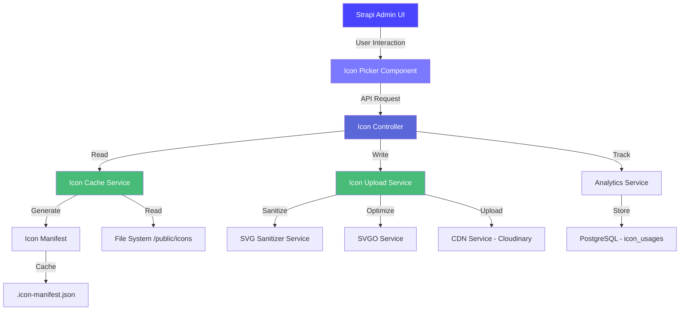
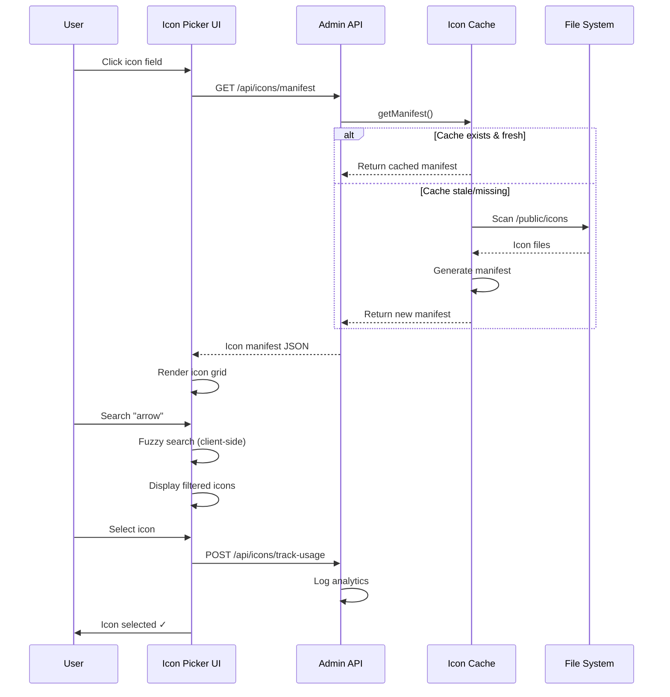

# Technical Architecture

[← Back to Overview](./README.md)

---

## System Architecture Diagram



---

## Data Flow: Icon Selection



---

## Database Schema (PostgreSQL)

### Icon Sets Table

**Purpose:** Store metadata about icon families (like Google Fonts families)

```sql
CREATE TABLE icon_sets (
  id SERIAL PRIMARY KEY,
  name VARCHAR(255) UNIQUE NOT NULL,
  display_name VARCHAR(255) NOT NULL,
  description TEXT,
  author VARCHAR(255),
  license VARCHAR(100),
  license_url TEXT,
  commercial_use BOOLEAN DEFAULT true,
  attribution_required BOOLEAN DEFAULT false,
  total_icons INTEGER DEFAULT 0,
  version VARCHAR(50),
  website_url TEXT,
  variants JSONB DEFAULT '["regular"]'::jsonb,
  tags JSONB DEFAULT '[]'::jsonb,
  created_at TIMESTAMP DEFAULT NOW(),
  updated_at TIMESTAMP DEFAULT NOW()
);

CREATE INDEX idx_icon_sets_name ON icon_sets(name);
CREATE INDEX idx_icon_sets_commercial_use ON icon_sets(commercial_use);
CREATE INDEX idx_icon_sets_attribution ON icon_sets(attribution_required);
```

**Example data:**

```sql
INSERT INTO icon_sets (name, display_name, description, author, license, commercial_use, attribution_required, total_icons, version, variants)
VALUES (
  '@mynaui/icons-react',
  'MynaUI Icons',
  'Beautiful, pixel-perfect icons for modern web applications',
  'MynaUI Team',
  'MIT',
  true,
  false,
  1247,
  '0.3.9',
  '["regular", "solid"]'::jsonb
);
```

### Icon Metadata Structure

**Note:** Icons are stored in `.icon-manifest.json`, not in database (for performance)

```typescript
interface IconMetadata {
  id: string;              // UUID
  name: string;            // 'arrow-right'
  path: string;            // '/public/icons/mynaui/arrow-right.svg'
  category: string;        // 'navigation'
  size: number;            // File size in bytes
  hash: string;            // MD5 hash for cache invalidation
  svg: string;             // Raw SVG content

  // NEW: Icon set and variant support
  iconSetId?: string;      // FK to icon_sets.id
  iconSetName?: string;    // '@mynaui/icons-react'
  variant?: string;        // 'regular' | 'solid' | 'sharp' | ...

  // NEW: Advanced metadata for filtering
  optimizedSizes?: number[];     // [16, 24, 32, 48, 64] - pixel heights
  isAnimated?: boolean;          // Contains animations
  hasPadding?: boolean;          // Has built-in padding
  isPreciseShape?: boolean;      // Geometric precision
  usesStrokes?: boolean;         // Stroke-based vs fill-based
  paletteType?: 'monotone' | 'multicolor';
  colorCount?: number;           // Number of colors

  // NEW: License metadata
  commercialUse?: boolean;       // Allows commercial use
  attributionRequired?: boolean; // Requires attribution
}
```

### Icon Usage Tracking Table

```sql
CREATE TABLE icon_usages (
  id SERIAL PRIMARY KEY,
  icon_id VARCHAR(255) NOT NULL,
  icon_name VARCHAR(255) NOT NULL,
  icon_set_id INTEGER REFERENCES icon_sets(id),
  variant VARCHAR(50),
  content_type VARCHAR(255) NOT NULL,
  field_name VARCHAR(255) NOT NULL,
  entity_id VARCHAR(255) NOT NULL,
  usage_count INTEGER DEFAULT 1,
  last_used TIMESTAMP NOT NULL DEFAULT NOW(),
  created_at TIMESTAMP DEFAULT NOW(),
  updated_at TIMESTAMP DEFAULT NOW()
);

CREATE INDEX idx_icon_usages_icon_id ON icon_usages(icon_id);
CREATE INDEX idx_icon_usages_icon_set_id ON icon_usages(icon_set_id);
CREATE INDEX idx_icon_usages_content_type ON icon_usages(content_type);
CREATE INDEX idx_icon_usages_last_used ON icon_usages(last_used);
```

### Icon Versions Table (History)

```sql
CREATE TABLE icon_versions (
  id SERIAL PRIMARY KEY,
  icon_id VARCHAR(255) NOT NULL,
  icon_set_id INTEGER REFERENCES icon_sets(id),
  variant VARCHAR(50),
  version INTEGER NOT NULL,
  svg TEXT NOT NULL,
  change_log TEXT,
  changed_by INTEGER REFERENCES admin_users(id),
  timestamp TIMESTAMP NOT NULL DEFAULT NOW()
);

CREATE INDEX idx_icon_versions_icon_id ON icon_versions(icon_id);
CREATE INDEX idx_icon_versions_icon_set_id ON icon_versions(icon_set_id);
CREATE INDEX idx_icon_versions_timestamp ON icon_versions(timestamp);
```

---

## Component Architecture

### Admin UI Components

```
admin/src/
├── components/
│   ├── IconPicker/
│   │   ├── IconPicker.tsx           # Main container
│   │   ├── IconSetBrowser.tsx       # Icon set selection
│   │   ├── IconGrid.tsx             # Icon grid display
│   │   ├── FilterPanel.tsx          # 5D filter system
│   │   ├── SearchBar.tsx            # Fuzzy search
│   │   ├── VariantComparison.tsx    # Side-by-side comparison
│   │   └── IconPreview.tsx          # Icon detail view
│   │
│   ├── IconField/
│   │   ├── IconField.tsx            # Custom field component
│   │   ├── IconInput.tsx            # Input wrapper
│   │   └── IconDisplay.tsx          # Selected icon display
│   │
│   └── Settings/
│       ├── PluginSettings.tsx       # Plugin configuration
│       ├── IconSetsManager.tsx      # Manage icon sets
│       └── AnalyticsDashboard.tsx   # Usage analytics
│
├── hooks/
│   ├── useIconSearch.ts             # Fuzzy search + filtering
│   ├── useIconSets.ts               # Icon set data fetching
│   ├── useFavorites.ts              # Favorites management
│   ├── useRecentIcons.ts            # Recent icons tracking
│   └── useIconAnalytics.ts          # Analytics queries
│
└── utils/
    ├── i18n.ts                      # Internationalization helper
    ├── iconValidation.ts            # Icon validation
    └── iconOptimization.ts          # Client-side optimization
```

### Server Components

```
server/src/
├── services/
│   ├── icon-cache.ts                # Manifest generation & caching
│   ├── icon-discovery.ts            # node_modules auto-discovery
│   ├── svg-sanitizer.ts             # XSS protection
│   ├── analytics.ts                 # Usage tracking
│   ├── versioning.ts                # Icon version control
│   ├── cdn-uploader.ts              # CDN integration
│   └── presets.ts                   # Icon preset management
│
├── controllers/
│   ├── icons.ts                     # Icon CRUD operations
│   ├── icon-discovery.ts            # Discovery API endpoints
│   ├── icon-sets.ts                 # Icon set management
│   ├── icon-batch.ts                # Batch operations
│   └── analytics.ts                 # Analytics endpoints
│
├── routes/
│   ├── icons.ts                     # Icon routes
│   ├── icon-discovery.ts            # Discovery routes
│   ├── icon-sets.ts                 # Icon set routes
│   └── analytics.ts                 # Analytics routes
│
└── content-types/
    ├── icon-set/
    │   └── schema.ts                # Icon set schema
    ├── icon-usage/
    │   └── schema.ts                # Usage tracking schema
    ├── icon-version/
    │   └── schema.ts                # Version history schema
    └── icon-preset/
        └── schema.ts                # Preset schema
```

---

## API Endpoints

### Icon Discovery (NEW in v2.0)

```typescript
GET    /api/icons-field/discover-icons
       // Discover all icons from configured packages
       Response: { data: IconMetadata[], meta: { total, packages, categories } }

GET    /api/icons-field/discover-icons/:packageName
       // Discover icons from specific package
       Response: { data: IconMetadata[], meta: { total, package } }

POST   /api/icons-field/discover-icons/refresh
       // Clear discovery cache
       Response: { message: "Icon cache cleared successfully" }
```

### Icon Management

```typescript
GET    /api/icons-field/icons
       // Get all icons with optional filters
       Query: iconSet, variant, optimizedSize, paletteType, commercialUse, attributionRequired
       Response: { data: IconMetadata[], meta: { total, filters } }

GET    /api/icons-field/icons/:id
       // Get single icon details
       Response: { data: IconMetadata }

POST   /api/icons-field/icons/batch-upload
       // Upload icons via ZIP file
       Body: FormData { icons: File }
       Response: { success: string[], errors: { file, error }[] }

DELETE /api/icons-field/icons/:id
       // Delete icon
       Response: { message: "Icon deleted" }
```

### Icon Sets

```typescript
GET    /api/icons-field/icon-sets
       // Get all icon sets
       Query: commercialUse, attributionRequired
       Response: { data: IconSetMetadata[] }

GET    /api/icons-field/icon-sets/:id
       // Get icon set details
       Response: { data: IconSetMetadata }

GET    /api/icons-field/icon-sets/:id/icons
       // Get icons from specific set
       Response: { data: IconMetadata[] }

GET    /api/icons-field/icon-sets/:id/variants
       // Get all variants of an icon set
       Response: { data: string[] }
```

### Analytics

```typescript
GET    /api/icons-field/analytics/popular
       // Get most popular icons
       Query: limit (default: 10)
       Response: { data: { iconId, iconName, usageCount }[] }

GET    /api/icons-field/analytics/unused
       // Get unused icons
       Response: { data: IconMetadata[] }

POST   /api/icons-field/analytics/track
       // Track icon usage
       Body: { iconId, iconName, contentType, fieldName, entityId }
       Response: { message: "Usage tracked" }
```

---

## Performance Optimization

### Caching Strategy

1. **Manifest caching:**
   - Generated once, cached for 1 hour (configurable)
   - Invalidated on icon changes
   - Stored in `.icon-manifest.json`

2. **Discovery caching (Development mode):**
   - In-memory cache for discovered icons
   - Cache TTL: 1 minute
   - Cleared on file changes (chokidar watch)

3. **Browser caching:**
   - Service worker for offline access
   - LocalStorage for filter preferences
   - IndexedDB for favorites/recent icons

### Bundle Optimization

- **Code splitting:** Lazy load icon picker modal
- **Tree shaking:** Import only used icons
- **SVG optimization:** SVGO in production build
- **CDN delivery:** Offload static assets

---

[← Back to Overview](./README.md)

---

**Last Updated:** 2025-11-26
