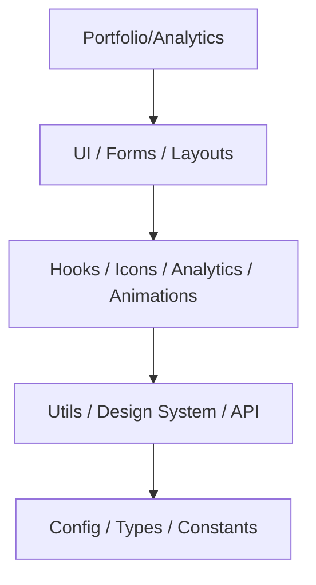

# Phase 4: Package Dependency Specification

📍 **Parent Document:** [Phase 4: DX Plan](../phase-4-developer-experience.md)

To prevent circular dependencies and maintain a high-performance build pipeline, this document defines the strict hierarchy of the **13 specialized packages**.

---

## 🏗️ The Dependency Hierarchy

The monorepo follows a **Layered Architecture**. Packages can only import from their own level or **lower** levels.

### Layer 0: The Bedrock (Zero Dependencies)
These packages are the foundation. They must not import from any other `@aazucena/*` package.
- **`@aazucena/config`**: Build tools (ESLint, TS, Tailwind presets).
- **`@aazucena/types`**: Pure TypeScript interfaces and types.
- **`@aazucena/constants`**: Global strings, magic numbers, and config objects.

### Layer 1: Core Logic
- **`@aazucena/utils`**: Pure helper functions (math, strings, date). *Depends on: types, constants.*
- **`@aazucena/design-system`**: OKLCH tokens and CSS variables. *Depends on: config.*
- **`@aazucena/api`**: Zod schemas, API clients, and transformers. *Depends on: types, constants, utils.*

### Layer 2: Capabilities
- **`@aazucena/hooks`**: React hooks. *Depends on: types, utils, api.*
- **`@aazucena/icons`**: Icon registry and components. *Depends on: design-system.*
- **`@aazucena/analytics`**: Telemetry and tracking services. *Depends on: api, constants.*
- **`@aazucena/animations`**: GSAP, Three.js, and PixiJS helpers. *Depends on: utils, constants.*

### Layer 3: UI & UX (Top Level)
- **`@aazucena/ui`**: Component library (ShadCN + Composed). *Depends on: design-system, hooks, icons, animations.*
- **`@aazucena/forms`**: Form systems and field components. *Depends on: ui, hooks, api.*
- **`@aazucena/layouts`**: Page and section layout components. *Depends on: ui, design-system.*

---

## 📈 Visual Graph (Simplified)

---

## 🛡️ Enforcement Rules

1. **No Circular Imports:** If Package A imports from Package B, Package B cannot import from Package A.
2. **Deep Imports Restricted:** Always use the main entry point or defined exports (e.g., `import { cn } from '@aazucena/utils'`).
3. **Peer Dependencies:** Heavy libraries (React, GSAP, Three.js) should be listed as `peerDependencies` in packages to avoid duplicate bundling in the apps.

---

**Last Updated:** 2026-02-05
**Status:** 🛡️ SPECIFICATION DEFINED
